# Génération aléatoire et résolution de Problèmes de Satisfaction de Contraintes (CSP)

*Antoine AGRÉ - 5A ICy - INSA Hauts-de-France - Automne 2023*

## Table des matières

1. [Contexte](#contexte)
    1. [Sujet et objectifs](#sujet-et-objectifs)
    2. [Format du rendu](#format-du-rendu)
2. [Programme](#programme)
    1. [Modélisation du problème](#modélisation-du-problème)
        1. [CSP](#csp)
        2. [Contraintes](#contraintes)
        3. [Assignations](#assignations)
    2. [Structure du programme](#structure-du-programme)
3. [Résultats](#résultats)
    1. [Méthode](#méthode)
    2. [Mesures](#mesures)
        1. [Taille de domaine](#taille-de-domaine)
        2. [Nombre de variables](#nombre-de-variables)
        3. [Densité](#densité)
        4. [Dureté](#dureté)
4. [Annexes](#annexes)
    1. [Exécutables](#exécutables)

---

## Contexte

Ce programme a été réalisé dans le cadre du cours de **Programmation par Contraintes**, qui a surtout porté sur les Problèmes de Satisfaction de Contraintes (CSP) binaires et les méthodes, algorithmes, heuristiques et langages utilisés pour les résoudre.

Le language choisi est Python (`3.11.1`).

### Sujet et objectifs

Le sujet porte sur deux objectifs :

1. **Générer aléatoirement des CSP binaires** selon 4 paramètres :
    - Le **nombre de variables** ;
    - La **taille des domaines** de ces variables ; 
    - La **densité du CSP** (la proportion des couples de variables qui possèdent une contrainte) ;
    - La **dureté des contraintes** du CSP (la proportion des couples de valeurs possibles qui sont autorisés pour chaque contrainte) ;
2. **Implémenter et appliquer 3 algorithmes** de recherche de solution de CSP :
    - Le **backtracking chronologique** "naïf" ;
    - Le **backjumping basé sur le graphe** (Graph-Based Backjumping) ;
    - Le **forward-checking**.

Aucun filtrage n'est utilisé. 

Pour simplifier leur exécution, les algorithmes s'arrêteront à la première solution trouvée, et leur but peut donc être considéré comme état de vérifier l'existence de solutions pour un CSP donné. 

Les assignations potentielles seront explorées dans le même ordre pour chaque algorithme, et ils devraient donc tous retourner la même solution si elle existe.

### Format du rendu

Ce README sera rendu au format `pdf`, accompagné des résultats des mesures (graphes et fichier `csv`) et des [exécutables](#exécutables).

Le code source est disponible sur le [dépôt Github](https://github.com/antoine-agre/randomcsp).

## Programme

### Modélisation du problème

Un CSP est un ensemble $\{V,D,C\}$ avec :

$$
\begin{cases}
V = \{V_1, V_2, \dots, V_n\} &\text{: ensemble fini de variables}
\\
D = \{D_1, D_2, \dots, D_n\} &\text{: ensemble de domaines (un par variable)}
\\
C = \{C_1, C_2, \dots, C_m\} &\text{: ensemble fini de contraintes}
\end{cases}
$$

Ici pour un CSP à $n$ variables et $m$ contraintes.

La première étape a donc été de choisir des structures de données pertinentes pour modéliser des CSP et les manipuler en Python.

#### CSP

On définit une classe `CSP` dans `csp.py`, qui contient les variables suivantes :
- `nb_variables` : *un entier*, le nombre de variables du CSP ;
- `domain_size` : *un entier*, la taille du domaine de chaque variables (on choisit de se limiter à des CSP dans lesquels chaque variable a le même domaine) ;
- `constraints` : *une matrice à 2 dimensions contenant `None` ou une liste de couples de valeurs*, qui modélise les contraintes entre les variables de ce CSP.

Pour simplifier le problème, on aura donc toujours des variables désignées par un entier de $0$ à $\text{nb\_variables} - 1$, dont les valeurs possibles seront entières et iront de $0$ à $\text{domain\_size} - 1$.

`constraints` est une matrice de taille [`nb_variables`][`nb_variables`], dans laquelle `constraints[i][j]` représente donc les contraintes entre les variables `i` et `j`.

Chaque couple de variable apparaissant deux fois, on prends donc la convention suivante : pour un couple de variables $(i,j)$, leurs contraintes sont représentées par `constraints[min(i,j)][max(i,j)]`, avec $i \neq j$. On utilise donc une matrice triangulaire supérieure, dans laquelle la diagonale est aussi vide.

#### Contraintes

Pour un couple de variables, les contraintes sont représentées par `None` ou une liste de couples d'entiers. 

`None` signifie qu'il n'existe pas de contraintes entre les deux variables, autrement dit n'importe quel couple de valeurs est correct.

Une liste de couple d'entiers signifie qu'il existe une contrainte entre les deux variables, et chaque couple d'entier représente des valeurs autorisées (toujours en suivant l'ordre `(min(i,j), max(i,j))`).

Le choix d'utiliser `None` est une complexité supplémentaire, mais qui permet d'éviter de générer et de garder en mémoire tous les couples de valeurs possibles pour chaque couple de variable sans contraintes. 

#### Assignations

Dans les algorithmes de recherche de solution, une assignation (partielle ou totale) sera représentée par une liste $[a_1, a_2, \dots, a_n]$ pour un problème à $n$ variables, dans laquelle $a_i$ représente la valeur assignée à la variable $i$ le cas échéant, et `None` sinon.

### Structure du programme

Le code source a la structure suivante :

- `graphs/` : contient les **graphes** générés par les mesures ;
- `randomcsp/` : le **package principal** qui contient le code source ;
    - `solver/` : le **package** contenant **les algorithmes** de recherche de solution ;
        - `backjumping.py` : le **module** qui implémente l'algorithme de **backjumping** ;
        - `backtracking.py` : le **module** qui implémente l'algorithme de **backtracking** ;
        - `forwardchecking.py` : le **module** qui implémente l'algorithme de **forward checking** ;
    - `timer/` : le **package** contenant **les outils** utilisés pour mesurer les performances des algorithmes ;
        - `timer.py` : le **module** qui implémente les méthodes utilisées pour mesurer et exporter les données ;
    - `__main__.py` : le **point d'entrée du projet**, contenant un bloc de démo et un bloc de mesure ;
    - `csp.py` : le **module** dans lequel est défini **la classe `CSP`** ;
- `README.md` : ce fichier ;
- `output.csv` : les résultats des mesures au format `csv`.

## Résultats

Une fois les algorithmes implémentés, des outils ont été implémentés dans le module `timer.py` afin de réaliser des mesures de performances sur les différents algorithmes.

### Méthode

La fonction `measure(solvers, tested_parameter, parameter_values)` retourne les points de données mesurés à partir des paramètres suivants :

- `solvers` : la liste des algorithmes à mesurer ;
- `tested_parameter` : un élément de l'énumération `Parameter`, indiquand quel paramètre varier parmi [les 4 possibles](#sujet-et-objectifs) lors de la génération d'un CSP ;
- `parameter_values` : la liste des valeurs que doit prendre successivement le paramètre à varier.

Les autres paramètres restent constants, pour tenter d'isoler l'impact du seul paramètre varié sur les performances des algorithmes. Leur valeur par défaut est la suivante :

- `nb_variables` = 10
- `domain_size` = 10
- `density` = 0.3
- `tightness` = 0.7

Pour chaque valeur à tester, on génère 5 (constante `CSP_MEASURES`) CSP différents à résoudre. Pour chaque paire CSP/algorithme, on mesure la moyenne de 5 (constante `TIME_MEASURES`) exécutions. On fait la moyenne de ces valeurs pour chaque CSP pour obtenir le point de donnée correspondant à une valeur de la variable testée, pour un CSP. À chaque fois, on mesure 3 valeurs : le **temps d'exécution**, le **nombre de retours en arrière**, et le **nombre de tests de cohérence**.

La fonction `measure` retourne donc une liste à 3 dimensions qui correspondent à : `[type de mesure][algorithme][point de donnée]`.

On a donc `liste[1][0][3]` le 4ème point de donnée du 2ème type de mesure du 1er algorithme, qui correspond donc à la 4ème valeur de `parameter_values`.

Pour résumer, chaque case du tableau suivant correspond à un jeu de données mesuré, et donc à un graphe :

| **Variable parameter** | **Temps CPU** | **Nombre de retours en arrière** | **Nombre de tests de cohérence** |
|---|---|---|---|
| **Taille de domaine** |  |  |  |
| **Nombre de variables** |  |  |  |
| **Densité** |  |  |  |
| **Dureté** |  |  |  |

### Mesures

En exécutant le programme principal (qui correspond à [l'exécutable](#exécutables) `tests.exe`), on a obtenu les résultats suivants :

#### Taille de domaine

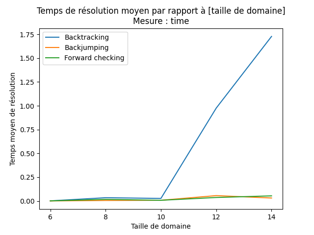
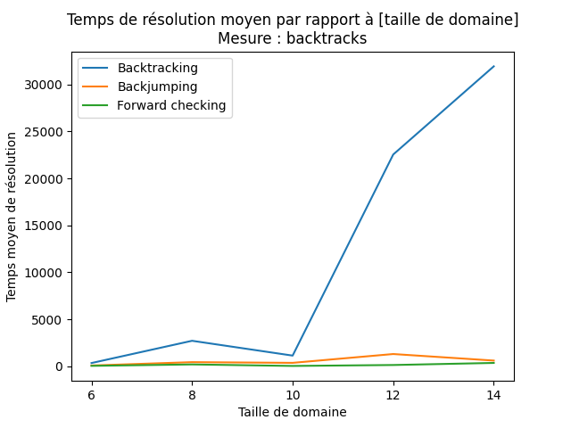
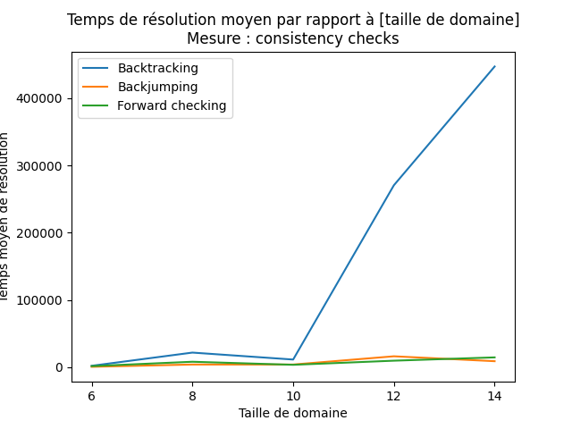

L'augmentation de la taille des domaines fait naturellement augmenter la complexité temporelle des algorithmes, même si cela reste peu perceptible avec les valeurs choisies pour les algorithmes de backjumping et de forward checking.

On observe une augmentation forte de la complexité temporelle du backtracking à partir de domaines de taille 12, qui montre qu'il devient très vite moins efficace que les autres.

#### Nombre de variables

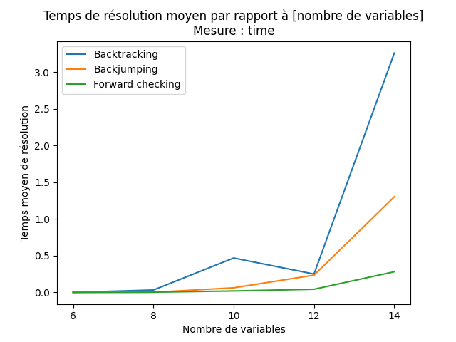
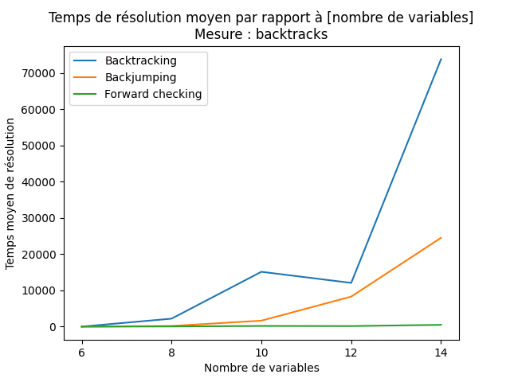
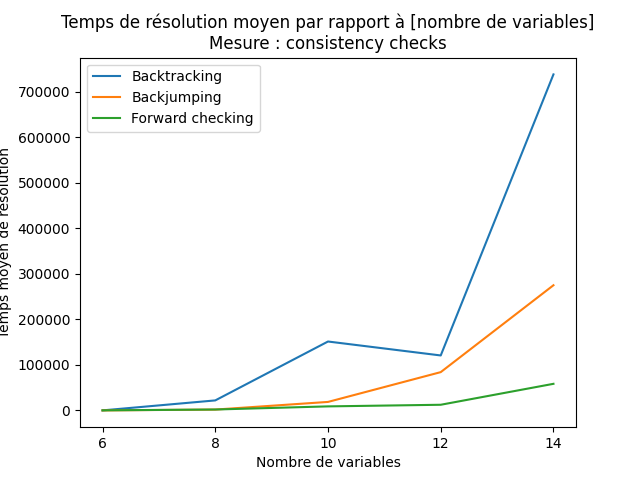

Pour le nombre de variables, on observe que les performances temporelles des trois algorithmes se séparent assez rapidement.

Comme attendu, le backtracking a les plus mauvaises performances, suivi par le backjumping, alors que le forward checking est le meilleur des trois.

#### Densité

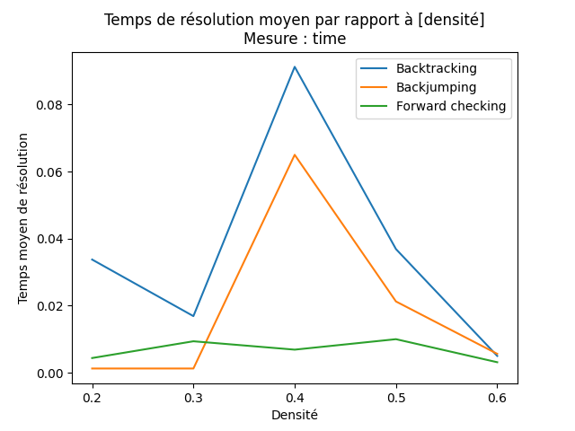
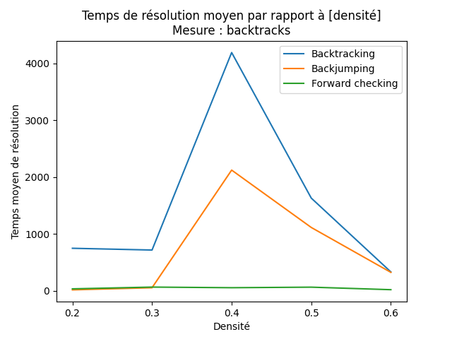
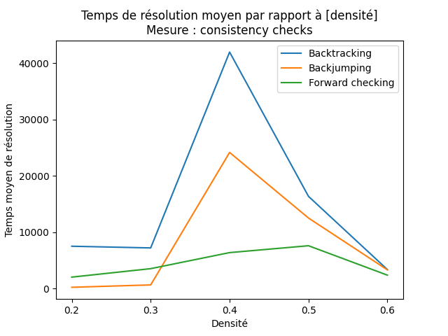

Pour la densité, on observe un pic pour la valeur `0.4`, et une tendance décroissante lorsque `x` augmente au-delà. Il est difficile de déterminer si ces résultats sont dus à une variabilité de la génération des CSP (puisque nous réalisons seulement des moyennes sur 5 mesures et 5 CSP différents), ou si les CSP sont réellement plus complexes pour une densité de `0.4`.

Une hypotèse serait que des valeurs faibles de densité donnent des CSP admettant plus de solutions, réduisant donc le temps de résolution ; alors que des valeurs élevées donnent des CSP avec beaucoup de contraintes, ce qui éliminerait plus vite des assignations potentielles. Ces deux effets s'annuleraient donc autour d'une densité de `0.4`, ce qui donnerait le pic observé.

A priori, les mesures effectuées ici ne sont pas assez précises pour permettre de confirmer cette hypothèse.

#### Dureté

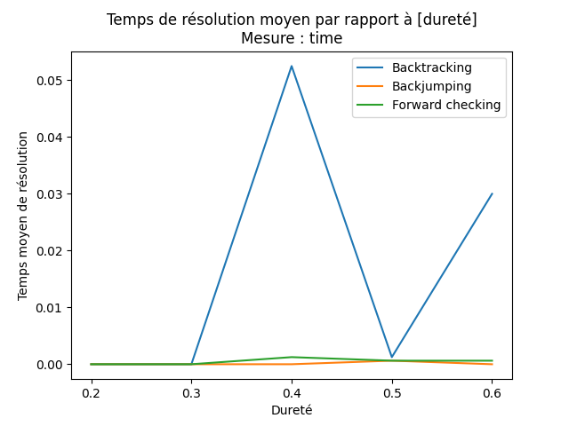
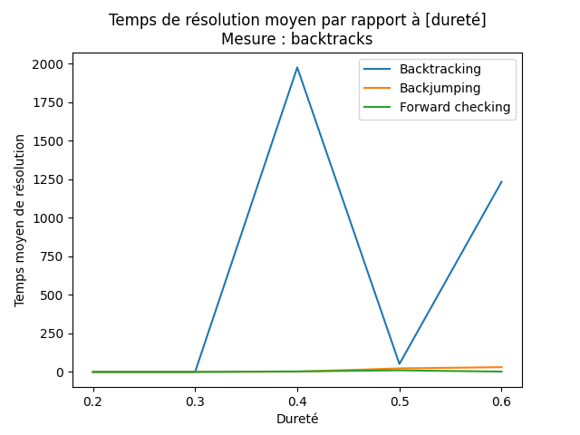
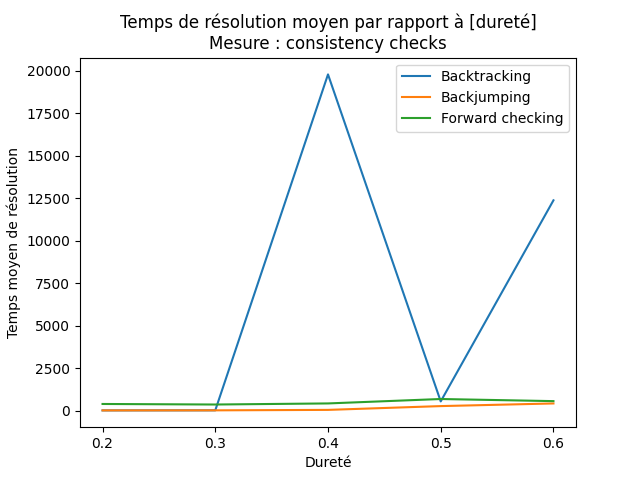

Pour la dureté, on observe encore un pic autour de `0.4`, et une tendance croissante ailleurs. Encore une fois, ces résultats sont a priori dus à une variabilité de la génération de CSP.

La tendance croissante est cohérente, puisque des CSP avec plus de dureté admettent plus de couples de valeurs possibles pour chaque contrainte, ce qui augmente l'espace de recherche. Il est intéressante de noter que les performances des algorithmes sont assez stables pour ces valeurs, à part pour le backtracking.

## Annexes

### Exécutables

Les exécutables sont générés avec `pyinstaller`, de la façon suivante :

```pyinstaller -F randomscp/__main__.py```

Les exécutables fournis sont les suivants :

- `tests.exe` : exécute les mêmes tests utilisés pour obtenir les résultats fournis (peut prendre plusieurs dizaines de minutes) ;
- `smaller_tests.exe` : exécute une démo des tests, avec des valeurs moins élevées, qui devrait être exécuté en quelques secondes ;
- `demo.exe` : une démo des fonctionnalités du code.

Les exécutables qui effectuent des mesures créent un fichier `output.csv` et un répertoire `graphs/` à l'emplacement du fichier exécutable.